  

  <strong>Building AI systems, creator infrastructure, and interactive products.</strong>

  

---

## Selected Work

### Creator Signal

**AI-powered creator intelligence platform.**

Researches YouTube markets, detects content opportunities, and connects creator analytics with AI-assisted research and packaging workflows. Includes a shared YouTube data layer and MCP access for AI tools and agents.

`Next.js` · `TypeScript` · `PostgreSQL` · `Prisma` · `Supabase` · `MCP` · `Gemini`

 

### Creator AutoEditor

**Local-first AI video production system.**

Turns scripts, voiceovers, and media into editable rough cuts, timeline decisions, and generated motion graphics while keeping the creator in control. Includes word-level voiceover/script alignment and automated scene selection.

`Electron` · `React` · `TypeScript` · `FFmpeg` · `WhisperX` · `Ollama` · `Codex` · `GSAP`

---

## Experiments & Other Builds

* **CaseCore** — Interactive 3D web experience using React Three Fiber, Three.js, and GSAP for WebGL product presentation and scroll-driven animation.
* **Pixel Survivor** — Mobile pixel-art survival roguelite prototype built with Godot 4 and GDScript.

---

## Toolbox

  
  
  
  
  
  
  
  
  
  
  
  

`MCP` · `Ollama` · `WhisperX` · `n8n` · `Three.js` · `GSAP`

---

## GitHub Activity

  
  &nbsp;
  

---

## About

Business Computer Science (*Wirtschaftsinformatik*) student in Germany, building software across AI, creator tooling, automation, and interactive products.

---

## Connect

[LinkedIn](https://www.linkedin.com/in/ruven-beckner-6b62231b4/) · [Email](mailto:kontakt@ruvenbeckner.de) · [GitHub](https://github.com/RuvenBeck)
